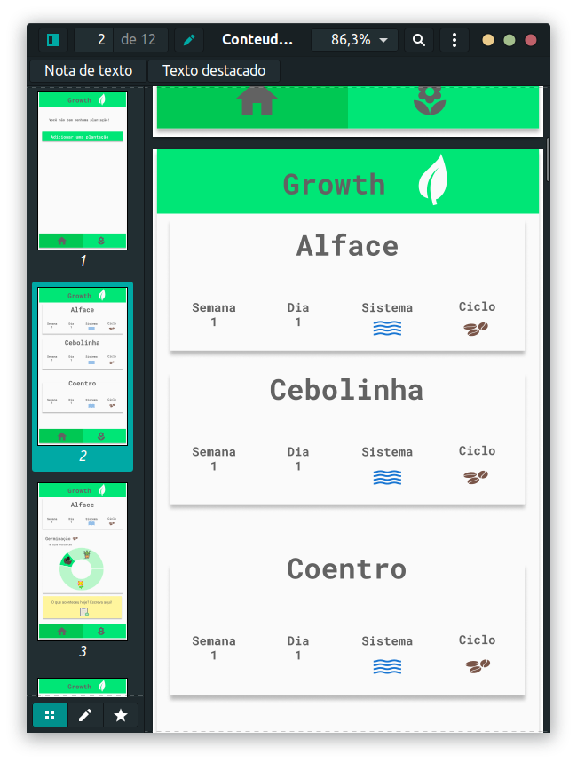
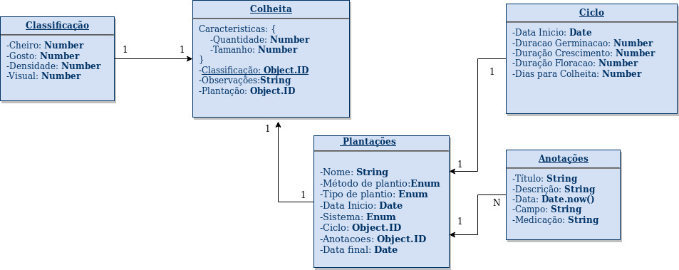

# Calendário Agricola para auxilio durante o período de plantio
O presente repositorio é dedicado ao desenvolvimento de um aplicativo que visa
auxiliar o agricultor a fazer o monitoramento do plantio até a colheita, onde ele
possa adicionar notas com observações, registrar e categorizar a colheita.

## Especificação: 

- Listar todas as plantações, caso exista:
    - Paginação;
    - Limitar o numero de resultados;
    - Filtrar por ID;
    - Apenas usuários autenticados;
- Adicionar uma plantação:
    - Apenas usuários autenticados;
    - Validação via mongoose;
    - Formatar as datas com moment.js;
    - **Talvez o usuário possa carregar uma foto da plantação e colocar como capa;**
- Atualizar plantação: 
    - Apenas o usuário "dono" da plantação;
    - Validação;
- Excluir plantação;
- Adicionar uma anotação:
    - Preencher com título, data e descrição;
    - A data será a data do dia formatada;
- Atualizar uma anotação:
    - Mudar o titulo;
    - Mudar a descrição;
    - Data não pode ser alterada;
- Listar uma plantação em detalhes:
    - Listar todos os campos sequencialmente;
    - Limitar as anotação pela data do dia;
- Popular o campo da colheita;
    - Automaticamente mandar as plantações para a colheita de acordo com as 
    datas de germinação, crescimento e floração informadas pelo usuário;
- Editar as informações da colheita: 
    - Caracteristicas para cada item da colheita como peso e densidade;
    - Classificação para cada item cheiro, gosto, densidade e aparencia;
- Ecluir a colheita;

- Usuário:
    - Autenticação via JWT e cookies;
- Registro de usuário:
    - Uma vez registrado, um token será enviado juntamente com um cookie;
    - Passwords precisam ser hasheados;
- Log in de usuario:
    - Usuário pode logar com password e senha;
    - O password será comparado com o password hasheado;
- Log out de usuario:
    - Um cookie será enviado ao token correspondente = none;
- Recuperação de password:
    - Usuarios podem pedir recuperação de senha;
    - Um token hasheado será enviado por email;
    - Uma requisição pu/patch será anexada a rota do email;
    - O token irá expirar em 10 minutos;
- Atualizar Usuário:
    - Somente usuários autenticados;
    - Rotas separadas a da recuperação de password;
- Listagem de usuários será feita diretamente no bancod e dados;
#### **\*Obs: As telas estão na pasta "mockups" do repositório;**





## Esquema do banco de dados:



## Stack a ser utilizada:
;

- Links úteis para a stack:
    - [Mongoose](https://mongoosejs.com/);
    - [NodeJS](https://nodejs.org/en/);
    - [MongoDB](https://nodejs.org/en/);
    - [Expres](https://expressjs.com/pt-br/);
    - [React Native](https://facebook.github.io/react-native/);
- Plataformas: Android e IOS;
- O Banco de dados está hospedado em um cluster, que está incluso no arquivo,
não é necessário a instação do banco na maquina;

## Instalação: 
- Dependencias:
    - Necessária a instalação do [NodeJS](https://nodejs.org/en/);

1. Clone o repositório:
    ```shell
    git@github.com:edward-teixeira/calendario-agricola-0118.git
2. Execute o seguindo comando:
    ```shell
    npm install
3. Para rodar o app
    ```shell
    npm run dev
O banco de dados é conectado automaticamente.